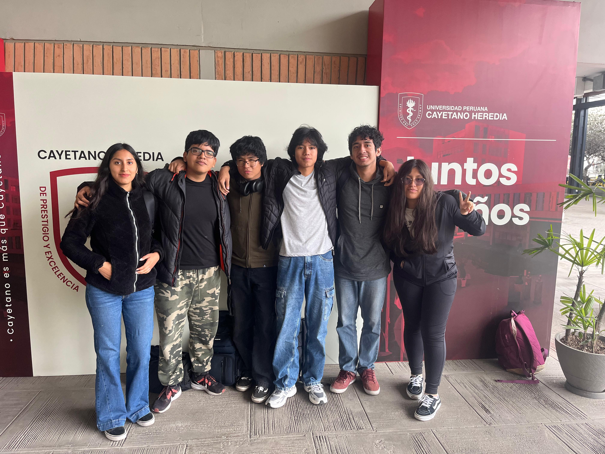
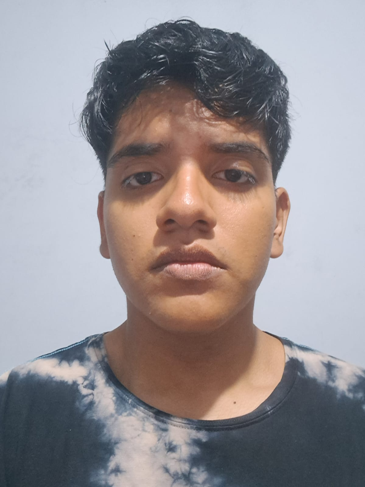

# Grupo 3: *Bionicos* 

## DESCRIPCIÓN DE GRUPO
Somos estudiantes de la carrera de Ingeniería Biomédica PUCP-UPCH, pertenecientes al segundo ciclo del curso "Procesos de Innovación en Bioingeniería". Este repositorio ha sido creado con el fin de presentar los avances que se vayan realizando de nuestro proyecto. Nuestro grupo (Número 3) lleva por nombre "Biónicos". 

## Integrantes

  
Rogger Agurto

  

    
EDAD: 17

    

PASATIEMPOS: Jugar videojuegos, programar, dormir, jugar basket y voley. Ademas disfruto investigar sobre lo q va venir en los proximos ciclos (mas si es FUNPRO 👩‍💻)

  

  
Gerson Rosas

  

    
Hola

  

  
Ariana Sifuentes

  
EDAD: 19 AÑOS
<./img/IMG-20250903-WA0314.jpg>
  PASATIEMPOS: Disfruto mucho de pasar tiempo con mis amigos, me encanta escuchar música y ver los atardeceres. Despues de terminar el pregado en Ingenieria Biomedica, quiero especializarme en biotecnologia e ingenieria de tejidos y biomateriales

  
Zahir Pisconte

  
 EDAD: 18 AÑOS 
  
 PASATIEMPOS: Jugar basquet y cantar en la ducha 

  

  
Valeria Mamani

  
 EDAD: 17 AÑOS
  
 Pasatiempos: Jugar videojuegos, hacer natación, la repostería y mi interés en el área de Ingeniería Biomédica es el área de Tejidos y Biomecánica.

  
Alejandro Toledo

 EDAD: 19 AÑOS

 Pasatiempoos: Ir al gimnasio, además me gusta pasar tiempo en el laboratorio de bioimpresión de la PUCP, me gustar disfrutar el tiempo con mi familia y con mis amigos, sobre mi interés en el área de Ingeniería Biomédica es el área de Señales e imágenes médicas para poder llegar a la rama de la neuroingeniería, otras ramas que me gustan de la ingeniría biomédica son la ingeniería tisular y biomécanica.
